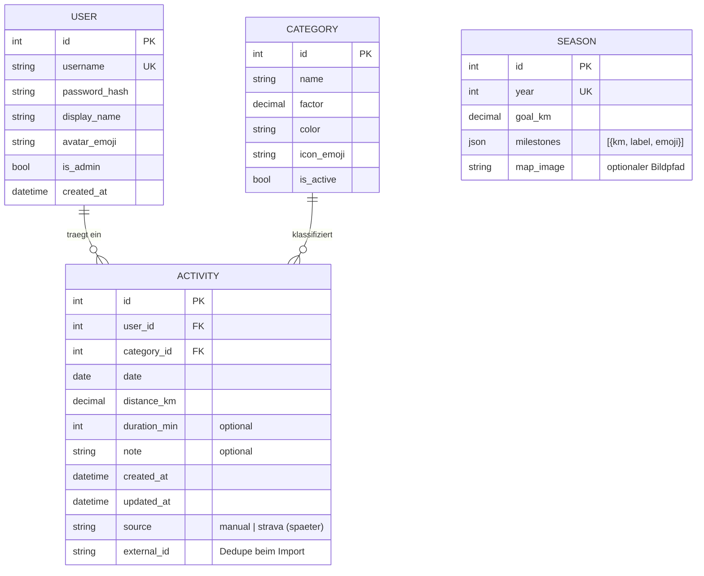

# MeterMachen — Design-Spezifikation

**Datum:** 2026-06-12
**Status:** Vom Auftraggeber freigegeben (Brainstorming-Session)

## 1. Überblick

MeterMachen ist eine selbst gehostete Multiuser-Webapp für einen privaten Freundeskreis (5–20 Personen). Jeder User trägt sportliche Aktivitäten ein; die zurückgelegte Distanz wird pro Kategorie mit einem Faktor skaliert (z.B. Joggen 4x, Radfahren 1x). Pro Kalenderjahr läuft ein Distanzvergleich aller User mit einem Jahresziel und vom Admin festgelegten Meilensteinen. Es zählt der reine Distanzvergleich — wer die meisten skalierten Kilometer sammelt, führt; Meilensteine sind gemeinsame Checkpoints auf dem Weg.

**Stack:** FastAPI (Python) + React (Vite, TypeScript). Ein Docker-Container, SQLite. Self-hosted.

## 2. Entscheidungen aus dem Brainstorming

| Thema | Entscheidung |
|---|---|
| Wettbewerbsmodus | Reiner Distanzvergleich pro Jahr, mit Meilensteinen als Checkpoints |
| User & Zugang | Geschlossener Freundeskreis; Admin legt Accounts an, keine Selbstregistrierung |
| Kategorien & Faktoren | Global, nur Admin pflegt sie (inkl. neuer Kategorien wie Tanzen) |
| Faktor-Änderung | Wirkt rückwirkend auf alle Einträge (skalierte km werden nie gespeichert, immer live berechnet) |
| Meilensteine | Admin definiert sie einmal pro Jahr (km-Wert, Label, Emoji) |
| Strava/Sportuhr | Nicht in V1; Datenmodell bereitet Import vor (`source`, `external_id`) |
| Aktivitäts-Eintrag | Datum + Distanz + Kategorie (Pflicht), Dauer + Notiz (optional), nachträglich editierbar mit „bearbeitet"-Kennzeichen |
| Hauptvisualisierung | Wanderkarte (Draufsicht, Brettspiel-Stil): SVG-Pfad durch Landschaft, Avatare an Position |
| Karten-Stil | SVG-Flat-Illustration als Basis; KI-generiertes Aquarell-Bild als optionale Hintergrund-Ebene (pro Jahr austauschbar) |
| Weitere Ansichten | Race-Bahnen (Linie mit Kategorie-Abschnitten pro User) + Jahresverlauf (kumulative Kurven) |
| Architektur | Ein Container: FastAPI serviert API + React-Build; SQLite auf Docker-Volume |

## 3. Seitenstruktur

1. **Login** — Benutzername + Passwort, HttpOnly-Session-Cookie.
2. **Meine Aktivitäten** — Eintragsformular + eigene Liste mit Bearbeiten/Löschen. Bearbeitete Einträge zeigen ein „bearbeitet"-Kennzeichen (`updated_at > created_at`).
3. **Vergleich** (Startseite nach Login) — drei Tabs, Jahres-Umschalter (vergangene Jahre bleiben einsehbar):
   - **Wanderkarte** (Standard-Tab)
   - **Race-Bahnen**
   - **Jahresverlauf**
4. **Admin** (nur Admin-Rolle) — Kategorien + Faktoren, User anlegen, Jahr konfigurieren (Ziel, Meilensteine, Kartenbild-Upload).

## 4. Datenmodell

SQLite via SQLModel. Skalierte km werden **nie gespeichert** — immer live `distance_km × factor` berechnet (dadurch wirken Faktor-Änderungen automatisch rückwirkend). Die Jahreszuordnung einer Aktivität ergibt sich aus ihrem `date` (kein FK auf Season).



**Regeln:**
- Kategorien werden nie gelöscht, nur deaktiviert (`is_active = false`). Deaktivierte Kategorien sind im Eintragsformular nicht wählbar; bestehende Einträge zählen weiter.
- Default-Kategorien beim ersten Start: Joggen 4x, Laufen 4x, Spazieren 3x, Wandern 3x, Schwimmen 10x, Radfahren 1x, Tanzen 3x. Alle Faktoren sind Startwerte und im Admin-UI änderbar.
- Validierung: `distance_km > 0`, `date` nicht in der Zukunft, Kategorie muss aktiv sein.

## 5. Backend (FastAPI)

```
backend/
├─ app/
│  ├─ main.py          # FastAPI-App, statisches Frontend mounten
│  ├─ models.py        # SQLModel-Tabellen
│  ├─ schemas.py       # Pydantic Request/Response-Modelle
│  ├─ auth.py          # Login, Session-Cookies, argon2-Hashing
│  ├─ deps.py          # get_db, get_current_user, require_admin
│  └─ routers/
│     ├─ activities.py
│     ├─ comparison.py
│     ├─ categories.py
│     ├─ seasons.py
│     └─ users.py
└─ tests/
```

**Auth:** Username/Passwort → signiertes HttpOnly-Session-Cookie. Passwörter mit argon2. Erster Admin-Account aus `ADMIN_USER`/`ADMIN_PASSWORD` beim Start.

**Endpunkte:**

| Methode | Pfad | Zugriff | Zweck |
|---|---|---|---|
| POST | `/api/auth/login`, `/api/auth/logout` | alle | Session auf-/abbauen |
| GET, POST | `/api/activities` | eingeloggt | eigene Liste (Filter: Jahr) / anlegen |
| PATCH, DELETE | `/api/activities/{id}` | Besitzer | nur eigene Einträge |
| GET | `/api/comparison/{year}` | eingeloggt | Aggregat für alle drei Ansichten |
| GET | `/api/categories`, `/api/seasons` | eingeloggt | Stammdaten lesen |
| POST, PATCH | `/api/categories…`, `/api/seasons…`, `/api/users` | Admin | Stammdaten/User pflegen |

**`/api/comparison/{year}`** liefert in einer Antwort: Season-Infos (Ziel, Meilensteine, Kartenbild) und pro User Gesamt-skalierte-km, Rang, Kategorie-Aufschlüsselung, chronologische Segmentliste (Race-Bahnen) und kumulative Zeitreihe (Jahresverlauf). Eine Query, kein Caching nötig.

**Aktivitäts-Erstellung** läuft intern durch eine einzige Funktion (Service-Schicht), die ein späterer Strava-Importer mitnutzt — Validierung gilt dann automatisch.

**Fehlerbehandlung:** Pydantic-Validierung → 422; Auth → 401/403; fehlende Ressourcen → 404. Frontend zeigt Fehler als Toast.

## 6. Frontend (React)

**Stack:** Vite + TypeScript, TanStack Query, React Router, Tailwind CSS, Recharts (nur Jahresverlauf). Mobile-first (Eintragen passiert meist am Handy).

```
frontend/src/
├─ api/            # typisierte Fetch-Wrapper
├─ pages/          # Login, MeineAktivitaeten, Vergleich, Admin
├─ components/
│  ├─ comparison/
│  │  ├─ WanderKarte.tsx
│  │  ├─ RaceBahnen.tsx
│  │  ├─ JahresVerlauf.tsx
│  │  └─ pathMath.ts   # reine Positions-Logik, unit-getestet
│  ├─ activities/
│  └─ ui/
```

**Wanderkarte (Herzstück):**
- Pfad als SVG-`<path>` mit S-Kurven durch eine Landschaft (Wiese → Wald → Berge → Fluss).
- Userposition: `path.getPointAtLength(anteil × pfadlänge)` mit `anteil = skalierte_km / goal_km`, gekappt bei 1.0 (wer das Ziel überschreitet, sitzt am 🏁; Mehr-km stehen im Badge).
- Ebenen: Hintergrundbild (hochgeladenes Aquarell; Fallback: Flat-SVG-Landschaft) → Pfad → Meilenstein-Checkpoints (Emoji + km) → Avatare mit Namens-Badge, Platz 1 mit Krone 👑.
- Sanfte CSS-Transition bei Positionsänderung; Klick auf Avatar → Popover mit Kategorie-Aufschlüsselung; überlappende Badges werden versetzt gestapelt.
- Spätere Spielereien (Mini-Games, Sonderfelder) sind durch die Draufsicht-Karte vorbereitet, aber nicht Teil von V1.

**Race-Bahnen:** pro User eine horizontale Bahn; Segmente = Aktivitäten chronologisch, Breite ∝ skalierte km, Farbe = Kategorie; horizontal scrollbar; Meilensteine als gestrichelte Querlinien; Hover/Tap zeigt Details.

**Jahresverlauf:** kumulative Kurven pro User (Recharts), Meilensteine als horizontale Referenzlinien.

## 7. Tests

Implementierung testgetrieben (TDD).

**Backend (pytest, In-Memory-SQLite):**
- Auth: Login richtig/falsch, 401 ohne Session, 403 für Admin-Routen als Normal-User
- Activities: CRUD, Fremdzugriff verboten, Validierung (negative Distanz, Zukunftsdatum, inaktive Kategorie), „bearbeitet"-Kennzeichen
- Skalierung: `distanz × faktor`, rückwirkende Faktor-Änderung, Jahresgrenzen (31.12./01.01.)
- Comparison: Ranking, Kategorie-Aufschlüsselung, kumulative Zeitreihe, leeres Jahr

**Frontend (Vitest + React Testing Library, gezielt):**
- Eintragsformular (Validierung, Absenden)
- `pathMath.ts` (Avatar-Positionierung als reine Funktion)
- SVG-Karte wird visuell geprüft, keine Pixel-Tests

**Nicht in V1:** E2E-Tests (Playwright) — Aufwand übersteigt Nutzen bei dieser Gruppengröße.

## 8. Deployment

- **Multi-Stage-Dockerfile:** Stage 1 baut React (`npm run build`), Stage 2 (Python/uv) serviert Build + API.
- **docker-compose.yml:** ein Service, Volume `/data` (SQLite + Kartenbilder), Env: `ADMIN_USER`, `ADMIN_PASSWORD`, `SECRET_KEY`.
- **Erster Start:** Tabellen anlegen, Admin-User anlegen, Default-Kategorien einspielen, Season für das aktuelle Jahr mit Platzhalter-Ziel anlegen.
- **Backup:** `/data` kopieren. HTTPS macht der Reverse-Proxy des Servers (außerhalb des Scopes).

## 9. Strava-Vorbereitung (kein Code in V1)

- `source` + `external_id` auf Activity verhindern später Import-Duplikate.
- Service-Schicht für Aktivitäts-Erstellung wird vom Importer mitgenutzt.
- Später nötig (eigenes Brainstorming): Strava-OAuth pro User, Mapping Strava-Sporttyp → Kategorie, Sync via Webhook/Polling.

## 10. Vom Auftraggeber noch zu liefern (blockiert die Umsetzung nicht)

- Endgültige Faktoren für Spazieren/Wandern/Schwimmen/Tanzen (Startwerte: 3/3/10/3) — im Admin-UI änderbar
- Jahresziel 2026 (skalierte km) und Meilenstein-Liste — im Admin-UI einstellbar
- KI-generiertes Kartenbild (Prompt liegt vor) — Upload im Admin-UI, Fallback existiert
